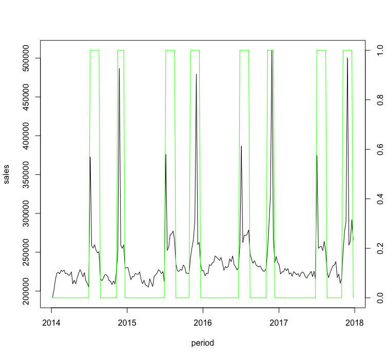
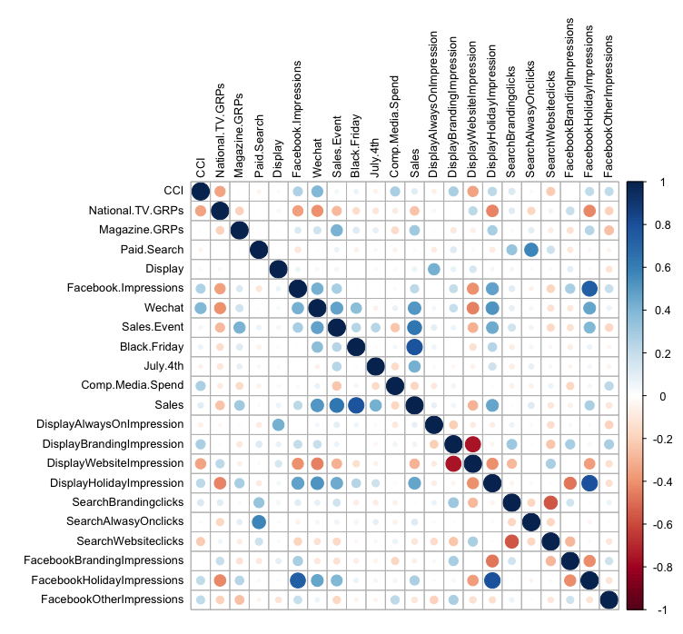
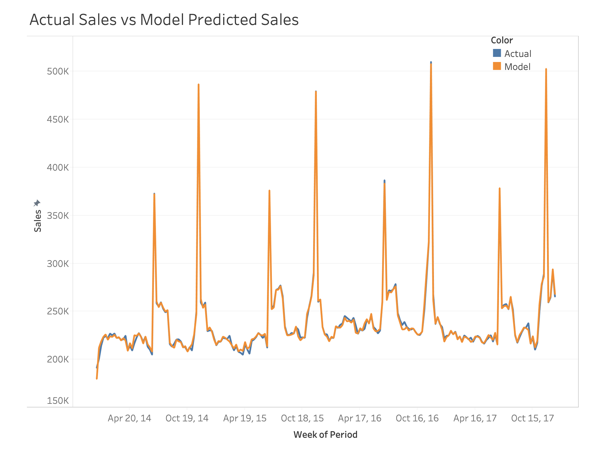
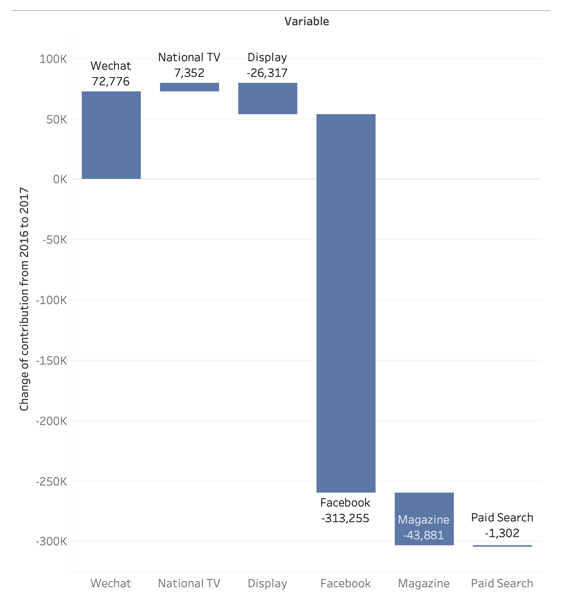

[](https://www.linkedin.com/in/ziyuan-byron-han/)
[](https://www.linkedin.com/in/ziyuan-byron-han/)
[](https://www.linkedin.com/in/ziyuan-byron-han/)
[](https://www.linkedin.com/in/ziyuan-byron-han/)
[](https://www.linkedin.com/in/ziyuan-byron-han/)
[](https://www.linkedin.com/in/ziyuan-byron-han/)

# Marketing Mix Modelling Project
This is an end-to-end project on marketing mix modelling of a Chinese branch US-based female quick fashion brand on data between 2014 and 2017. 

* The goal of this project is to evaluate 2017 performance and provide actionable recommendation for 2018.
* Final Presentation Powerpoint here: [(Powerpoint)](final_presentation.pdf).

## TLDR, this project includes:
* Maintaining ETL data pipeline in MySQL server [(MySQL code)](MySQL/data_preprocess.sql)
* Data Transformation & model selection in R [(R transformation section & Model section)](https://rpubs.com/zhan12/692404)
* Model evaluation & Business insight visualization in Tableau ([Powerpoint](final_presentation.pdf), [Tableau workbook](Tableau/mmm.twb))
* Side diagonistic[(R side diagnosis section)](https://rpubs.com/zhan12/692404)
* Budget spending optimization & recommendation in R [(R optimization section)](https://rpubs.com/zhan12/692404)
* Final presentation with company team [(Powerpoint)](final_presentation.pdf)

<!-- 
## Technical summary for tools & models
* Collected, aggreagted, cleaned data using MySQL to manage ETL process.
* Created EDA data visualizaiton using Tableau.
* Performed multivariate regression models using R to evaluate marketing tactics impact.
* Built Tableau workbooks to visualize model results; Also including informative AVM, model contributions, media ROIs to deliver key business insights.
* Analyzed effectiveness and efficiency of media activities (e.g., TV GRPs, Paid Search Clicks, Facebook ads, Display Impressions, etc.).
* Provided actionable recommendation on budget optimization using Excel Solver.
* Created presentation deck to summarize model findings and presented result to marketing team.
-->

## Table of Content
* [Background and Data Description](#Background-and-Data-Description)
* [MySQL ETL pipeline for preprocessing](#MySQL-ETL-pipeline-for-preprocessing)
* [Data Transformation in R](#Data-Transformation-in-R) 
* [Model Selection and Evaluation](#Model-Selection-and-Evaluation)
* [Model Result Evaluation](#Model-Result-Evaluation)
* [Side Diagnosis](#Side-Diagnosis)
* [2018 Budget optimization](#2018-Budget-optimization)
* [Final Presentation](#Final-Presentation)


## Background and Data Description
A US based fashion design company has sales data, marketing activities and spending data, events data between 2014 and 2017.

Marketing and sales team want to understand:
* What are the impacts of different marketing channels on our sales?
* How are the marketing channels performing in 2017 compared to 2016?
* What are the effectiveness and efficiency (ROI) for each channel?
* How should we optimize spending on difference marketing channels in 2018?
* What will the predicted sales be in 2018?

So I use Marketing Mix Model to tackle these problems.

Data example[(link)](data) is limited to header and 1 line only.
```bash
├── Sales: 
│   └── MMM_Sales_Raw.csv
├── Marketing activity:
│   ├── MMM_AdWordsSearch_2015.csv
│   ├── MMM_AdWordsSearch_2017.csv
│   ├── MMM_DCMDisplay_2015.csv
│   ├── MMM_DCMDisplay_2017.csv
│   ├── MMM_Event.csv
│   ├── MMM_Facebook.csv
│   ├── MMM_Offline_TV_Magazine.csv
│   └── MMM_Wechat.csv
├── Marketing spending:
│   └── MMM_Spending.csv
├── Competitor
│   └── MMM_Comp_Media_Spend.csv
├── Environment (could include other market specific) 
│   └── CCI.csv
└── Other
    ├── MMM_Date_Metadata.csv
    └── MMM_DMA_HH.csv
```
<!--https://stackoverflow.com/questions/24319505/how-can-one-display-images-side-by-side-in-a-github-readme-md-->
EDA capture anomalies      |  EDA correlation overview
:-------------------------:|:-------------------------:
  |  

## MySQL ETL pipeline for preprocessing
**Aggregated marketing activities for MMM model & side diagnosis in MySQL server [(MySQL code)](MySQL/data_preprocess.sql).**
* Spending is added in R section
* Final data for R:
```bash
├── Sales
├── Facebook Impressions 
│   ├── Total
│   ├── Branding
│   ├── Holiday
│   └── Other
├── Google Ad Search Clicks
│   ├── Total
│   ├── Branding
│   ├── AlwaysOn
│   └── Website
├── Display Impressions
│   ├── Total
│   ├── Branding
│   ├── AlwaysOn
│   ├── Website
│   └── Holiday
├── WeChat Read
│   ├── Total
│   ├── Article
│   ├── Moment
│   └── Other
├── National TV
├── Magazine
├── Competitor
├── Sales Event
├── Black Friday
├── July 4th
└── CCI
```
* To make ETL more robust, 2015-data is preloaded, and 2017-data with 6-month overlap is added later.
* Only select 1-3 drivers for each channel for simplicity of this project.
* data is aggregated on weekly level to reduce noise and overfitting.
* Other detail can be found in MySQL notes


## Data Transformation in R
**Lag, Decay and Power is applied to 6 marketing channels [(R Code)](https://rpubs.com/zhan12/692404).**

|             |    Decay    | Lag | Alpha |
|:-----------:|:-----------:|:---:|:-----:|
| National TV |     0.8     |  0  |  0.9  |
| National TV |     0.8     |  1  |  0.6  |
|   Magazine  |     0.7     |  1  |  0.6  |
|   Magazine  |     0.9     |  1  |  0.6  |
| Paid Search |     0.9     |  0  |   1   |
| Paid Search |     0.9     |  1  |  0.7  |
|   Display   |     0.8     |  0  |  0.8  |
|   Display   |      1      |  0  |   1   |
|   Facebook  |      1      |  0  |  0.8  |
|   Facebook  |      1      |  1  |   1   |
|    Wechat   |     0.8     |  0  |  0.9  |
|    Wechat   |     0.9     |  1  |   1   |

* Advertising intensity, competitive interference and wear-out impacts on advertising effectiveness, but for simiplicity we only look at:
    - Lag
    - Decay
    - Diminishing return (Power curve)

* Adstock's lag effect is firstly estimated using: 
    - A_{t} = A_{t-lag}  
* Adstock's decay effect is secondly expressed using one carry-over model: 
    - At =  At * decay + At-1 * (1 - decay)
* Adstock's diminishing return effect is estimated using: 
    - At = At ** power(alpha)
* Details for Decay, Lag & Alpha in power curve.
    - Traditional media normally has higher lag.
    - Online media noramlly has high decay.
    - More other decay models can be found [here](https://mpra.ub.uni-muenchen.de/7683/4/MPRA_paper_7683.pdf) or other online resources.
    - More other diminishin return models can be found [here](https://www.lexjansen.com/nesug/nesug08/sa/sa03.pdf) or other online resources.


## Model Selection and Evaluation
**R Model selection code: [R code](MySQL/data_preprocess.sql)** 
* To reduce model overfitting, Final model is a multi-variates linear regression between Sales Volume and baseline variable, transformed marketing variable & competitor spending. 
* In a few words, model is selected to maximize to R^2 and minimize MAPE(mean absolute percentage error) without breaking statistical & business criterias. More details are written below.
```bash
├── Dependent Variable: 
│   └── Sales
└── Independent Variables:
    ├── Marketing controllable:
    │   ├── Facebook Impression Total
    │   ├── Google Ad Search Clicks Total
    │   ├── Display Impressions Total
    │   ├── WeChat Read Total
    │   ├── National TV
    │   └── Magazine
    ├── Sales Event (non-marketing controllable)
    ├── Baseline:
    │   ├── Black Friday (company specific)
    │   ├── July 4th (company specific)
    │   └── CCI (non-company specific)
    └── Competitor Spend
```
* Start with baseline variables & non-marketing controllable as baseline model.
* Then add marketing variables, start with the channel with the most spending, choose the transformation between the most R^2, smallest p-value, least MAPE.
* During the process, check statistical validity such as p-value, VIF, residual error, qq-plot etc, check sign of coefficient etc.
* Detailed variables are omitted to reduce overfitting and data granularity.

Actual vs Model      |  model 2017 sales contribution breakdown
:-------------------------:|:-------------------------:
  |  


## Model Result Evaluation 
**You can read in final_presentation [Powerpoint](final_presentation.pdf) or download and open Tableau workbook here: [Tableau workbook](Tableau/mmm.twb)).**
* I built tableau workbooks to visualize model results over all channels between 2016/2017, including 
	- Actual vs Model (AVM) 
	- Sales contributions in marketing vs non-marketing
	- Compare sales change in 2016 vs 2017 
	- Comapre media effectiveness & efficiency

loss breakdown by group      |  loss breakdown by detail
:-------------------------:|:-------------------------:
  |  


## Side Diagnosis
**R side analysis section: [R code](https://rpubs.com/zhan12/692404)** \
I picked Facebook as an example, built another multi-variates linear regression:
```bash
├── Dependent Variable: 
│   └── Sales contributions by Facebook
└── Independent Variables:
    ├── Branding
    ├── Holiday
    └── Other
```


## 2018 Budget optimization
**R optimization section [R code](https://rpubs.com/zhan12/692404)**  
* First for marketing activities, I distributed the spending into different channel according to their activity in 2017, and multiplied by new-channel-spending/old-channel-spending.
* For non-marketing activities, I used 2017 data.
* Finally, I aggreagted data and used coefficient from best model to calculate result.
* I used lpSolve to find the solution. and also replicated the process in Excel solver.


## Final Presentation
**Full [Powerpoint](final_presentation.pdf)** 


